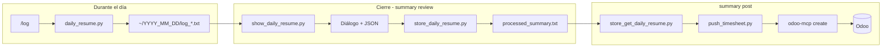

# Executive Assistant: minutas, resúmenes y carga de timesheets

Este paquete documenta la **skill** de asistente ejecutivo: capturar trabajo del día, convertirlo en entradas imputables a Odoo y subirlas de forma reproducible.


## Qué problema resuelve

1. **Durante el día:** registrar hitos y reuniones sin depender de pegar notas a mano en el ERP.
2. **Al cerrar el día:** acordar contigo cómo agrupar esas minutas en líneas de timesheet (tarea, horas, redacción).
3. **Al publicar:** volcar el JSON aprobado a Odoo como registros en `account.analytic.line`, vía [odoo-mcp-multi](https://pypi.org/project/odoo-mcp-multi/) (`odoo-mcp create`).

## Estructura del directorio

| Ruta | Rol |
|------|-----|
| `identity.md` | Rol del asistente y enrutamiento de comandos de alto nivel. |
| `rules/minute_taker.md` | Reglas de `/log` y auto-log técnico. |
| `rules/redaction_rules.md` | Reglas adicionales de redacción (si aplica). |
| `workflows/weekly_timesheet_create_summary.md` | Flujo `/summary review` (borrador JSON + `store_daily_resume.py`). |
| `workflows/weekly_timesheet_push_summary.md` | Flujo `/summary post` (`store_get` + `push_timesheet.py`). |
| `scripts/*.py` | Herramientas invocadas solo con `python3` (ver tabla abajo). |

## Comandos que debe reconocer el agente

Definidos en `identity.md` (En caso de usar el IDE Cursor, debemos de agregar el contendido de `identity.md` a `.cursorrules`. En caso de usar Google Antigravity, no hace falta este ajuste):

| Comando | Acción |
|---------|--------|
| **`/log [texto]`** o auto-log | Seguir `rules/minute_taker.md`: ejecutar `daily_resume.py` con el texto; **no** crear archivos de minuta en el workspace con el editor. |
| **`/summary review`** | Seguir `workflows/weekly_timesheet_create_summary.md`: leer logs del día, dialogar contigo, generar JSON Odoo, y con tu aprobación ejecutar `store_daily_resume.py` pasando el JSON como **único argumento** en terminal. |
| **`/summary post`** | Seguir `workflows/weekly_timesheet_push_summary.md`: `store_get_daily_resume.py` y, si OK, `push_timesheet.py` con el JSON recuperado. |

## Scripts (`scripts/`)

Todos asumen ejecución desde la **raíz del repo** del proyecto, por ejemplo:

`python3 ./.custom_agents/executive_assistant/scripts/<script>.py [argumentos]`

| Script | Argumentos | Efecto |
|--------|------------|--------|
| `daily_resume.py` | Un string: `"[PROYECTO]: descripción"` | Crea `log_HHMMSS_ffffff.txt` bajo `DAILY_RESUMES_PATH/YYYY_MM_DD/`. |
| `show_daily_resume.py` | Ninguno | Imprime en stdout el contenido de todos los `log_*.txt` del día (ordenados). |
| `store_daily_resume.py` | Un string: JSON o texto del resumen aprobado | Escribe `processed_summary.txt` en el directorio del día. |
| `store_get_daily_resume.py` | Ninguno | Imprime en stdout el contenido de `processed_summary.txt` del día; si no existe, error y código ≠ 0. |
| `push_timesheet.py` | Un string: JSON **array** de objetos | Por cada elemento, `odoo-mcp create -p <perfil> -m account.analytic.line -v <json>` (ver requisitos abajo). |

### Variable de entorno `DAILY_RESUMES_PATH`

- Si **no** está definida, los scripts anteriores usan por defecto el **home del usuario** (`~`), igual que `daily_resume.py`.
- Los artefactos del día viven en:  
  **`$DAILY_RESUMES_PATH/YYYY_MM_DD/`**  
  con archivos `log_*.txt` y, tras el review aprobado, `processed_summary.txt`.

Si en algún entorno necesitas otra base (por ejemplo un disco compartido), exporta la misma variable antes de **todos** los pasos del día.

## Formato del JSON para Odoo (timesheet)

Array de objetos con al menos los campos que tu instancia exija en `account.analytic.line`. El flujo habitual acordado en el review incluye:

```json
[
  {
    "name": "Descripción (qué / por qué / cómo)",
    "task_id": 12345,
    "unit_amount": 2.5
  }
]
```

- **`name`:** texto de la línea (idioma y longitud los defines en el diálogo del review).
- **`task_id`:** ID numérico de la tarea de proyecto en Odoo.
- **`unit_amount`:** horas (decimal).

Tu instancia puede exigir campos adicionales (fecha, empleado, etc.); ajústalos en el review o en el script de push si centralizáis defaults.

## Integración con Odoo (`push_timesheet.py`)

1. Instalar y configurar **odoo-mcp-multi** (`pipx install odoo-mcp-multi`, `odoo-mcp add-profile`, etc.). Documentación: [PyPI — odoo-mcp-multi](https://pypi.org/project/odoo-mcp-multi/).
2. El binario **`odoo-mcp`** debe estar en el `PATH` del proceso que ejecuta `push_timesheet.py`.
3. El perfil usado en el script está fijado en código (`vauxoo` en la versión actual); cámbialo o parametrizalo según tus entornos.
4. Cada línea del array genera un **`create`** independiente; repetir el post con el mismo `processed_summary.txt` **duplicará** imputaciones salvo que borres o archive el resumen del día antes de volver a subir.

## Reglas para el agente (resumen operativo)

- **Invocación:** usar **solo** `python3` + ruta al script bajo `.custom_agents/executive_assistant/scripts/`. Evitar `python3 -c`, wrappers opacos o `subprocess` desde código arbitrario cuando el usuario espera auditar “solo tu script”.
- **`/summary review` — guardado:** construir el JSON en contexto; ejecutar `store_daily_resume.py` con ese texto como primer argumento (p. ej. comillas simples en bash alrededor del JSON). **No** crear en el workspace archivos intermedios solo para alimentar `store` (ni `timesheet_summary.json` ni `$(cat ...)` como sustituto del flujo acordado).
- **`/summary post`:** si `store_get_daily_resume.py` falla, **no** llamar a `push_timesheet.py`; informar el error tal cual lo imprime el script.

## Flujo visual



## Documentación detallada

- Minutas y auto-log: `rules/minute_taker.md`
- Review y JSON: `workflows/weekly_timesheet_create_summary.md`
- Push: `workflows/weekly_timesheet_push_summary.md`

## Mantenimiento

- Si cambiáis el modelo de datos de timesheet en Odoo, revisad los campos en `push_timesheet.py` y en el formato del review.
- Si añadís perfiles o entornos, alinead el flag `-p` de `odoo-mcp` con vuestra política (staging vs producción).
